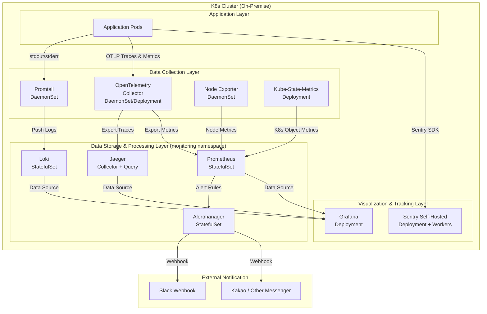

# 시스템 아키텍처 설계서 (ARCHITECTURE)

## 1. 개요
온프레미스 Kubernetes 클러스터에서 장애 포인트를 식별하고 대응하기 위한 종합 모니터링 파이프라인의 시스템 아키텍처를 정의한다.
모든 컴포넌트는 **Helm Chart** 기반으로 배포하며, 각 차트의 `values.yaml`을 커스텀 파일로 관리한다.

## 2. 전체 아키텍처



## 3. Namespace 전략

| Namespace    | 용도                                      | 포함 컴포넌트                                            |
|-------------|------------------------------------------|--------------------------------------------------------|
| `monitoring`| 메트릭 수집, 알람, 시각화                   | Prometheus, Alertmanager, Grafana, Node Exporter, KSM  |
| `logging`   | 로그 수집 및 저장                           | Loki, Promtail                                         |
| `tracing`   | 분산 트레이싱                              | OpenTelemetry Collector, Jaeger                        |
| `sentry`    | 에러 트래킹                                | Sentry (+ PostgreSQL, Redis, ClickHouse 등 의존성)       |

## 4. 데이터 흐름 (Data Flow)

### 4.1 메트릭 흐름 (Metrics)
```
Node Exporter (DaemonSet) ──scrape──▶ Prometheus (StatefulSet)
Kube-State-Metrics ─────────scrape──▶ Prometheus
Otel Collector ─────────────export──▶ Prometheus (remote write)
Prometheus ──────────────────query──▶ Grafana (Dashboard)
Prometheus ──────────────────rules──▶ Alertmanager ──webhook──▶ Slack
```

### 4.2 로그 흐름 (Logs)
```
Pod stdout/stderr ──▶ Promtail (DaemonSet, /var/log/pods 마운트)
                         └──push──▶ Loki (StatefulSet)
                                       └──LogQL──▶ Grafana Explore
```

### 4.3 트레이스 흐름 (Traces)
```
App (Otel SDK) ──OTLP/gRPC──▶ Otel Collector (DaemonSet)
                                  └──export──▶ Jaeger Collector
                                                  └──▶ Jaeger Query/UI
                                                  └──▶ Grafana (Jaeger Data Source)
```

### 4.4 에러 트래킹 흐름 (Errors)
```
App (Sentry SDK) ──HTTP──▶ Sentry Relay ──▶ Sentry Server
                                               └──▶ Sentry Web UI (Issue Dashboard)
```

## 5. 영구 스토리지 전략 (PersistentVolume 설계)

| 컴포넌트       | Storage Class | 용량 (권장 최소) | 보존 기간 | 비고                              |
|--------------|--------------|----------------|----------|----------------------------------|
| Prometheus   | local-path   | 50Gi           | 15일      | `--storage.tsdb.retention.time`  |
| Loki         | local-path   | 100Gi          | 30일      | `retention_period` 설정           |
| Jaeger       | local-path   | 30Gi           | 7일       | Elasticsearch/Cassandra 백엔드   |
| Sentry       | local-path   | 50Gi           | 90일      | PostgreSQL + ClickHouse 데이터   |
| Alertmanager | local-path   | 5Gi            | -         | 알람 히스토리 저장                  |
| Grafana      | local-path   | 5Gi            | -         | 대시보드 JSON, 플러그인 저장        |

> **참고**: `local-path`는 온프레미스 환경 기본 예시이며, NFS/Ceph 등 공유 스토리지를 사용할 경우 StorageClass를 변경한다.

## 6. Helm 배포 전략

### 6.1 디렉토리 구조 (src/)
```
src/
├── kube-prometheus-stack/
│   ├── DESIGN.md                  # 모듈 설계서
│   └── custom-values.yaml         # Helm values 오버라이드 파일
├── opentelemetry-collector/
│   ├── DESIGN.md
│   └── custom-values.yaml
├── jaeger/
│   ├── DESIGN.md
│   └── custom-values.yaml
├── sentry/
│   ├── DESIGN.md
│   └── custom-values.yaml
└── loki-stack/
    ├── DESIGN.md
    └── custom-values.yaml
```

### 6.2 Helm 배포 명령 규칙
모든 컴포넌트는 아래 패턴으로 통일한다:
```bash
# 1. Helm 레포지토리 추가
helm repo add <repo-name> <repo-url>
helm repo update

# 2. 공식 values.yaml 추출 (최초 1회)
helm show values <repo-name>/<chart-name> > src/<module>/default-values.yaml

# 3. custom-values.yaml 작성 (default-values.yaml 기반으로 수정)
# → src/<module>/custom-values.yaml

# 4. 배포
helm install <release-name> <repo-name>/<chart-name> \
  --namespace <namespace> \
  --create-namespace \
  -f src/<module>/custom-values.yaml

# 5. 업데이트
helm upgrade <release-name> <repo-name>/<chart-name> \
  --namespace <namespace> \
  -f src/<module>/custom-values.yaml
```

## 7. 네트워크 설계

### 7.1 내부 통신
- 모든 모니터링 컴포넌트 간 통신은 **K8s ClusterIP Service**를 통해 이루어진다.
- Otel Collector → Jaeger: `gRPC (port 14250)`
- Otel Collector → Prometheus: `HTTP Remote Write (port 9090)`
- Promtail → Loki: `HTTP Push (port 3100)`

### 7.2 외부 노출
- Grafana, Sentry UI, Jaeger UI는 **NodePort** 또는 **Ingress**를 통해 내부망에서 접근 가능하도록 설정한다.
- Alertmanager → Slack은 **Outbound HTTP Webhook**을 사용한다.

## 8. 보안 고려사항
- Grafana, Sentry, Jaeger 대시보드 초기 접속 시 기본 관리자 비밀번호를 반드시 변경한다.
- 민감 정보(DB Password, Slack Webhook URL 등)는 `K8s Secret`으로 관리하며, `custom-values.yaml`에 직접 기재하지 않는다.
- Secret 생성 예시:
  ```bash
  kubectl create secret generic grafana-admin \
    --namespace monitoring \
    --from-literal=admin-user=admin \
    --from-literal=admin-password=<SECURE_PASSWORD>
  ```
